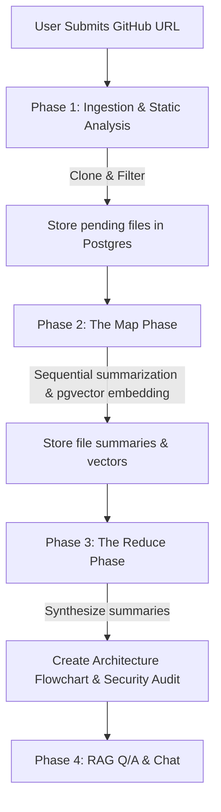

# CodeRecall Interview Study Guide & Project Overview

This document serves as a comprehensive technical guide to the architecture, pipeline stages, engineering highlights, and expected interview questions for the **CodeRecall** codebase.

---

## 🚀 Project Overview & Elevator Pitch

### What is CodeRecall?
**CodeRecall** is an enterprise-grade AI-powered code auditing, security scanning, and interactive codebase retrieval (RAG) platform. 
Users input a remote Git repository URL. The application clones, parses, and indexes the entire codebase. It runs deep static and semantic audits (generating code quality summaries and flagging security vulnerabilities), builds a high-level systems architecture report with visual flowcharts, and exposes a real-time conversational chat interface (RAG) where developers can query the codebase directly.

### The Problem It Solves
1. **Developer Onboarding**: Engineering teams take weeks to understand large legacy repositories. CodeRecall cuts this down to minutes by generating instant architecture summaries and interactive Q/A logs.
2. **Instant Security Audits**: Traditional static code scanners (SAST) flag thousands of syntax rules without context. CodeRecall uses LLMs to understand code semantics, filtering out false positives and detailing recommendations with exact context.
3. **Conversational Retrieval**: Instead of grepping through source folders, developers can ask questions like *"Where is the auth middleware initialized and what models are used?"* and get contextual code references.

---

## 🏗️ Technical Architecture & Stack

The system is built as a highly decoupled, three-tier SaaS application:

```text
                  +-------------------------------------------------+
                  |      CLIENT/FRONTEND LAYER (React/Vite SPA)     |
                  |  - Cozy Warm Beige / Dark Theme (Toggleable)    |
                  |  - Live terminal output (log polling)           |
                  |  - jsPDF Engine with page split & ASCII map     |
                  +------------------------+------------------------+
                                           |
                              HTTP REST    | (JSON, Auth Header)
                                           v
                  +-------------------------------------------------+
                  |             BACKEND LAYER (FastAPI)             |
                  |  - Async Thread Pool Ingestion (shallow clone)  |
                  |  - Map-Reduce Loop with Tenacity Retries        |
                  |  - Rate-Limiter (min 4.0s spacer, fallbacks)    |
                  |  - Firebase Cryptographic RS256 Auth Middleware |
                  +------------------------+------------------------+
                                           |
                            SQL / pgvector | (SQLAlchemy ORM)
                                           v
                  +-------------------------------------------------+
                  |        DATA/PERSISTENCE LAYER (Supabase)        |
                  |  - PostgreSQL Database with pgvector extension  |
                  |  - Tables: 'repository_files', 'user_mappings'  |
                  +-------------------------------------------------+
```

### 1. Client Layer (React / Vite SPA)
*   **Technologies**: React, TypeScript, Tailwind CSS, jsPDF.
*   **Key Responsibilities**: User authentication interface (Firebase), repository input form, live logs streaming console, code visualizer panels, conversational chat assistant, and the PDF Report exporter.
*   **Visual Style**: Warm beige/minimalist layout with smooth scroll reveal animations, rotating funny progress excuses during long analyses, and a toggleable high-contrast dark theme.

### 2. Backend Layer (FastAPI Core)
*   **Technologies**: FastAPI, Python, SQLAlchemy, GitPython, Google GenAI SDK, Tenacity.
*   **Key Responsibilities**: Non-blocking repository ingestion (cloning in a separate thread), code parsing, database transaction handling, asynchronous Map-Reduce orchestration, dynamic Gemini model fallbacks, rate-limiting control, and RAG vector searches.

### 3. Data Layer (PostgreSQL + pgvector on Supabase)
*   **Technologies**: PostgreSQL, pgvector.
*   **Key Responsibilities**: Stores code content, metadata, analysis metrics, user mappings, and 3072-dimensional vector embeddings.

---

## 🔄 Core Processing Pipeline (The 4 Phases)

When a user submits a GitHub URL, the system executes a four-phase pipeline:



### Phase 1: Ingestion & Static Analysis
*   The backend performs a **shallow clone (`depth=1`)** of the remote repository to a temporary directory.
*   It walks the file tree and applies a **two-tier defense sanitization**:
    *   **Tier 1 (The Blacklist)**: Skips binary files, images, system logs, lockfiles (`yarn.lock`, `package-lock.json`), and configurations that clutter context.
    *   **Tier 2 (Hard Size Limit)**: Files exceeding 1MB are labeled `<FILE TOO LARGE TO PROCESS>` and flagged as `skipped` to protect LLM context windows and prevent token explosion.
*    Legitimate files are stored in the `repository_files` database table with their status set to `pending`.

### Phase 2: The Map Phase
*   The worker pulls `pending` files and processes them sequentially.
*   **Task A (Vector Embeddings)**: Generates a 3072-dimensional semantic vector using Google's `gemini-embedding-2` model. If a file is large, it is split into chunks of 4,000 characters using a `RecursiveCharacterTextSplitter`, embedded, and averaged into a single representational vector.
*   **Task B (Analysis & Summarization)**: Calls `gemini-3.1-flash-lite` to perform a static review. It outputs a strict JSON structure containing a 2-3 paragraph summary of the file's purpose, API configurations, and identified security issues (severity and description).

### Phase 3: The Reduce Phase (Master Synthesis)
*   Once all files are analyzed, the system pulls all file summaries and security issues.
*   **Master Architect**: Calls `gemini-3.5-flash` to synthesize the codebase structure into a "Global Project Overview" along with a custom **vertical, 3-tiered ASCII systems architecture flowchart** (under 90 characters wide).
*   **Master Security Auditor**: Reviews raw issues, removes false positives, and formats an Executive Security Audit Report categorized by severity (Critical, High, Medium, Low).
*   Both are stored under a special reserved file path (`__GLOBAL_REPORT__`) in the database.

### Phase 4: Conversational Retrieval (RAG Q/A)
*   When a user asks a question, the question is vectorized.
*   A **cosine similarity search** is run on PostgreSQL using `pgvector` to pull the top 10 most relevant code chunks.
*   The context (retrieved chunks, up to 40,000 characters per file, plus the Global Project Overview) is fed to `gemini-3.5-flash` along with the user's question, producing a highly accurate, cited response.

---

## 🧠 Core Engineering Highlights (Impressive Talking Points)

If a recruiter or technical interviewer asks, *"What was the most challenging part of this project?"* or *"What engineering decisions are you most proud of?"*, reference these points:

### 1. Defensive System Optimization
*   **Rate Limits and Quotas**: Google Gemini's free tier imposes a strict limit of 15 requests per minute (RPM). We engineered an asynchronous request spacer (`limiter.py`) that uses an `asyncio.Lock` to enforce a minimum **4.0-second delay** between all generation queries.
*   **Rotating Model Fallback Chain**: Free keys have a low Daily Request Limit (e.g. 20 requests/day for experimental models). We designed a dynamic fallback wrapper that catches `429 ResourceExhausted` errors, waits 2 seconds, and automatically migrates the query down a fallback model chain (`gemini-3.5-flash` -> `gemini-3.1-flash-lite`) while utilizing fallback API keys in memory to finish the scan.

### 2. High-Performance DB Schema (Single Table Approach)
*   Instead of splitting folders, components, summaries, and vulnerabilities into separate database tables that require expensive SQL joins, we implemented a **Single Table Approach** using the `JSONB` data type in PostgreSQL. File metadata, summaries, and issues are stored as indexable JSON objects, which simplifies scaling and accelerates query speeds.

### 3. Multi-Page PDF Generation Handling
*   Generating PDFs of ASCII art in client-side Javascript is notoriously difficult because font size, page margins, and page-breaking logic often cause text overlap or line wrapping.
*   We resolved this by using a monospaced font (**Courier**) at size `6.5` with a line-height of `3.6` to fit up to 90 characters per line. 
*   We implemented a **look-ahead pre-scanning routine** in the PDF exporter: it scans ahead when it finds a code block, calculates its exact height, and adds a page break *before* starting the block if it would split across pages.
*   Finally, we wrote a Unicode translator map to convert any box-drawing characters (e.g. `┌`, `─`) to standard ASCII (e.g. `+`, `-`) to avoid character corruption in PDF formats.

---

## ❓ Expected Interview Questions & Answers

### Q1: Why did you choose pgvector on PostgreSQL instead of a dedicated Vector DB like Pinecone?
**Answer**: 
> "For this application, PostgreSQL with `pgvector` was the most pragmatic and efficient choice. Dedicated vector databases like Pinecone introduce an extra system dependency, network latency, synchronization complexity, and subscription costs. By using pgvector, we achieved a **unified database design**. We store the file's raw content, LLM summaries, security logs, and vector embeddings in the exact same row. This allowed us to query relational metadata (like `repo_url` and `user_id`) and perform semantic cosine distance searches in a single SQL query, keeping transaction times fast and database management simple."

### Q2: How do you handle authentication in this system, and how is it secure?
**Answer**: 
> "We use **Firebase Authentication** on the client side to handle user sign-in flows (via Google OAuth). When the frontend communicates with our FastAPI backend, it passes the user's Firebase ID Token in the `Authorization` header. On the backend, we verify the signature of this token cryptographically using RS256 decoding against Google’s public certificates. To ensure security, we fetch Google's public keys on-the-fly and check key expiration, client IDs, and project scopes. 
> To protect resources, the user's unique identifier (`user_id`) is attached to every repository file entry. Whenever a user initiates a RAG Q/A search or views reports, we explicitly filter database queries by their `user_id`, ensuring strict multi-tenant isolation."

### Q3: Cloning repositories on a web server can block the event loop. How did you design the ingestion phase to prevent FastAPI from hanging?
**Answer**: 
> "FastAPI runs on an asynchronous event loop, meaning synchronous operations (like git-cloning or directory walking) can block the entire process, causing other users' requests to time out. To solve this, we offload the cloning and ingestion logic to a separate worker thread pool using **`asyncio.to_thread`**. This lets FastAPI handle incoming requests, status polling, and chat queries concurrently while a background thread manages disk I/O. 
> Additionally, to prevent Render's gateway from hitting its 30-second timeout limit, we batch database commits. Instead of committing records inside the parsing loop (which issues individual database network connections), we generate UUIDs locally and insert all records in a single database transaction."

### Q4: How does the RAG (Retrieval-Augmented Generation) pipeline retrieve relevant context, and what happens if a code file is very large?
**Answer**: 
> "When a user asks a question, we vectorize the question using `models/gemini-embedding-2` and perform a cosine distance similarity query on our pgvector table, returning the top 10 most relevant code chunks.
> To prevent context bloat and ensure fast response times, we cap individual retrieved code file context at **40,000 characters** (~10,000 tokens). This is large enough to capture the entirety of almost all codebase files (for example, standard 6–10 KB files fit completely) while still preventing massive build packages or system logs from overflowing the prompt context. If the file is larger than 40k characters, it truncates gracefully with an ellipsis."

### Q5: How did you scale the Map phase to avoid hitting Google's free API rate limits?
**Answer**: 
> "During the Map phase, we analyze and embed every file in the repository. If a repository has 40 files, triggering parallel requests would immediately trigger a `429 RateLimitExceeded` error on Gemini's free tier. 
> We resolved this by:
> 1. Restricting concurrency to 1 using an `asyncio.Semaphore(1)`.
> 2. Processing files sequentially in a loop.
> 3. Spacing generation requests by at least **4.0 seconds** using a centralized async rate-limiter, while running the high-quota embeddings concurrently.
> 4. Implementing tenacity retry decorators that wait exponentially (up to 10 seconds) on transient 429 and 503 errors to guarantee the ingestion completes successfully without dropping files."
